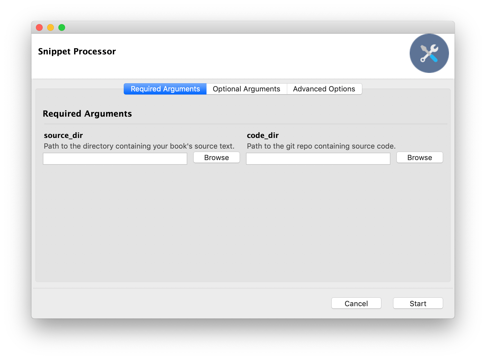

# Snippet Processor

We write [a lot of books](https://www.secretlab.com.au/books) for O'Reilly Media, and lots of them involve putting example code that we've written in. Copying and pasting code is risky, when you update your code and forget to update the book, so we wrote this!

Snippet Processor lets you refer to code from one file (e.g. asciidoc source of a book, say) by including tags referring to parts of another file (e.g. your example source code). This lets you write source code that looks like this:

```csharp
// BEGIN input_mouse
if (Input.GetMouseButtonDown(0))
{
    Debug.Log("Left mouse button was pressed!");
}

if (Input.GetMouseButton(0))
{
    Debug.Log("Left mouse button is being held down!");
}

if (Input.GetMouseButtonUp(0)) {
    Debug.Log("Left mouse button was released!");
}
// END input_mouse
```

And include a comment in your written content like this:

```asciidoc
You access the button states in a very similar way to how you access the keys on the keyboard (see <<input-keyboard>>), by using the +Input+ class's +GetMouseButtonUp+, +GetMouseButtonDown+, and +GetMouseButton+ methods:

// snip: input_mouse
```

The `// snip: input_mouse` code will be expanded out to this:

```asciidoc
// snip: input_mouse
[source,csharp]
----
if (Input.GetMouseButtonDown(0))
{
    Debug.Log("Left mouse button was pressed!");
}

if (Input.GetMouseButton(0))
{
    Debug.Log("Left mouse button is being held down!");
}

if (Input.GetMouseButtonUp(0)) {
    Debug.Log("Left mouse button was released!");
}
----
```

## Why Use Snippet Processor?

**Simple**: You never need to manually copy and paste code into your documentation again. Every time you run the program, your text will be updated with your code.

**Straightforward**: Tagging lines of code is easy, and adding a reference to a tag in your text is even easier.

**Powerful**: Your tagged code can be nested inside other tagged, code, and your text can be extremely specific about what combination of tags you want to render. You can also specify a git tag, or even a specific commit hash, to pull from. This makes it perfect for tutorials where you make changes to source code over multiple steps - just commit different versions, and refer to past versions in your text!

**Tidy**: The process is fully reversible; if you run the program and turn on the 'clean' option, the code will be removed from your text, leaving behind just the `// snip:` instruction.

## How To Use This Program

Snippet Processor assumes that your code and your text are in two folders. Additionally, _your code must be in a git repo_. The code doesn't necessarily have to be committed to the repo, but the folder itself must be a valid repo with at least one commit.

Launch the program, and set the `source_dir` to the folder containing your book's text, and the `code_dir` to the folder containing your code. Click the **Start** button, and your snippets will be expanded!



## Installing

We currently offer a macOS build, since that's what we use. Click the Releases tab at the top of the page to download it!

## Usage

### Rendering Snippets

First, include snippet(s) in your text file, by adding a comment that begins with `snip:`, followed by one or more tags that exist in your source code:

```asciidoc
// snip: (snippet name), [(snippet name)...]
```

You can use the word `except` to exclude but exclude certain tags:

```asciidoc
// snip: (snippet name), [(snippet name)...] except (snippet name), [(snippet name)...]
```

The snippet detector will warn you if multiple files contain tags with the same name.

You can include code with certain tags, as long as they don't have any other tags as well.

```asciidoc
// snip: isolating (snippet name)
```

### Using Git History

By default, Snippet Processor will pull its content from the files on disk, exactly as they're stored. However, it can be useful to retrieve earlier versions of a snippet. 

When you include a `tag` command in your code, Snippet Processor will use the contents of files as they existed at that point in your git history. For example:

```asciidoc
// snip: file_version
----
This is version 2.0 of my file!
----

// Ask Snippet Processor to use content as at the tag 'v1.0':

// tag: v1.0

// snip: file_version
----
This is version 1.0 of my file!
----
```

When you specify a `tag`, Snippet Processor will use that tag for all future `snip` instructions until it hits the end of the file, or encounters another `tag` instruction. If you want to reset Snippet Processor to its initial state - that is, using the contents of the file on disk in the working copy, and ignoring git history - then set the tag to `working-copy`:

```asciidoc
// Use the contents of files as they exist on disk right now, 
// rather than getting it from git history

// tag: working-copy
```

## Credits

Written by Jon Manning, at [Secret Lab](https://secretlab.com.au).

[Spell book icon](https://game-icons.net/1x1/delapouite/spell-book.html) by Delapouite, licensed under a Creative Commons Attribution 3.0 license.